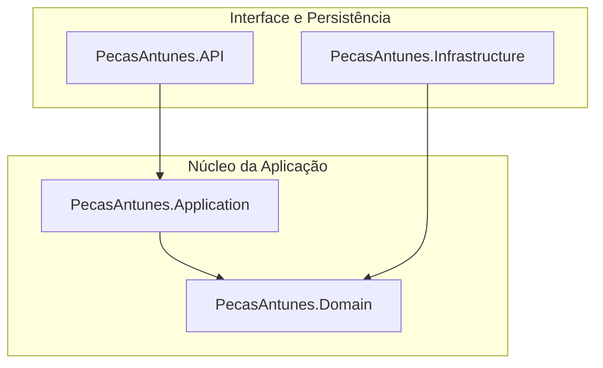

# 🏎️ PecasAntunes API - Gestão de Ativos
Este projeto é uma solução de backend profissional desenvolvida em .NET 8 para o controle, organização e gestão de autopeças.

## 🏗️ Estrutura e Arquitetura
O sistema utiliza Clean Architecture para garantir o desacoplamento entre a regra de negócio e a infraestrutura.



## 🚦 Endpoints Principais (API)
| Método | Endpoint | Descrição |
| :--- | :--- | :--- |
| `POST` | `/api/AutoPecas` | Cadastra uma nova peça com validação de domínio. |
| `GET` | `/api/AutoPecas` | Lista todas as peças cadastradas. |

___
## 🚀 Guia de Configuração e Execução

### 1. Infraestrutura de Dados (Docker)

Para garantir a persistência, o SQL Server é provisionado via container com volume mapeado.
- Nota: Certifique-se de que a pasta de volume existe: c:\volumes\mssql (use sempre minúsculas).


#### Download da imagem e criação do container

``` docker pull mcr.microsoft.com/mssql/server:2022-latest```

```bash
docker run -d `
  --name sqlserver-pecasantunes `
  -e "ACCEPT_EULA=Y" `
  -e "MSSQL_SA_PASSWORD=SenhaForte@123" `
  -p 1433:1433 `
  -v c:\volumes\mssql:/var/opt/mssql `
  mcr.microsoft.com/mssql/server:2022-latest
```
### 2. Configuração de Conexão

No ficheiro ```src/PecasAntunes.API/appsettings.json```, valide a Connection String:

```bash
"ConnectionStrings": {
  "DefaultConnection": "Server=localhost,1433;Database=PecasAntunesDb;User Id=sa;Password=SenhaForte@123;TrustServerCertificate=True;Encrypt=False;"
}
```

### 3. Persistência e Migrations
Execute os comandos na raiz do projeto para sincronizar o banco de dados:

### Restaurar dependências e pacotes
```Bash
dotnet restore
```

### Aplicar Migrations (O Elo Final)
```bash
dotnet ef database update --project src/PecasAntunes.Infrastructure --startup-project src/PecasAntunes.API
```

### 4. Executar o Projeto
```Bash
dotnet run --project src/PecasAntunes.API
```

Acesse a documentação Swagger em: ```https://localhost:5001/swagger```


