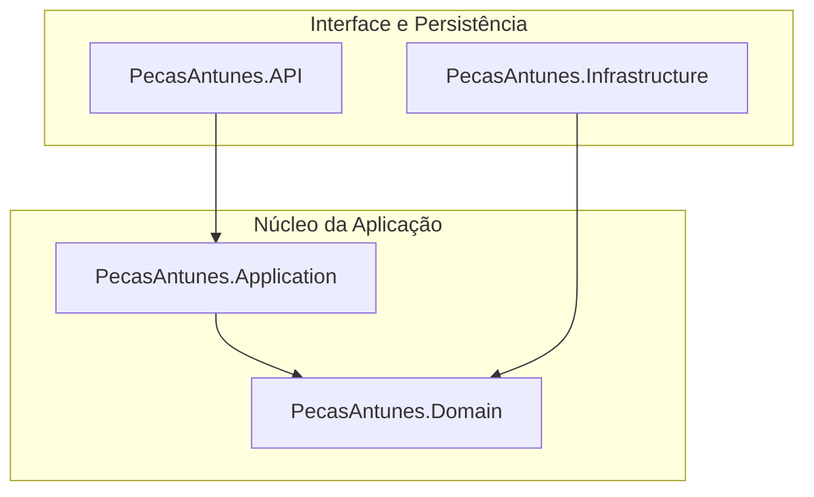

# 🏎️ PecasAntunes API — Gestão de Autopeças.

API REST profissional desenvolvida em .NET 8 para controle, organização e gestão de autopeças.<br>
Projeto pensado para portfólio, testes técnicos e demonstração prática de arquitetura limpa + deploy em nuvem.

## 🚀 Teste Agora

👉 API em Produção (Render):
https://pecasantunes-api.onrender.com

👉 Swagger (Documentação interativa):
https://pecasantunes-api.onrender.com/swagger

👉 HealthCheck:
https://pecasantunes-api.onrender.com/health

## ✅ Como testar a API em 1 minuto

#### 1. Abra o Swagger
#### 2. Clique em POST /api/v1/AutoPecas
#### 3. Use este exemplo:

```JSON
{
  "nome": "Filtro de Óleo",
  "codigo": "FO123",
  "codigoInterno": "INT-001",
  "marca": "Bosch",
  "descricao": "Filtro de óleo para motores 1.6",
  "preco": 49.90,
  "quantidadeEstoque": 10
}
```

#### 4. Clique em Execute.
#### 5. Depois use o GET /api/v1/AutoPecas para validar que salvou no banco real.

## 🖥️ Testar com Front-end.
O front consome a API pública em produção.

## ▶️ Como testar o front localmente
#### 1. Suba o front (Live Server / Vite / etc)
#### 2. Garanta que o front está apontando para:

```javaScript
const API_URL = "https://pecasantunes-api.onrender.com/api/v1/AutoPecas";
```
#### 3. Teste:
 - Tela de listagem de peças
 - Tela de cadastro de peça

📌 Resultado esperado:
 - Cadastro cria peça no banco real (Neon)
 - Lista mostra os dados da API em produção

## 🏗️ Estrutura e Arquitetura
O sistema utiliza Clean Architecture para garantir desacoplamento entre regra de negócio e infraestrutura.



🧠 Stack Tecnológica
 - .NET 8
 - Entity Framework Core
 - PostgreSQL (Neon – banco em nuvem gratuito)
 - Render (Deploy da API)
 - Swagger (Documentação da API)
 - Docker (build e deploy da API no Render)


## 🚦 Endpoints Principais (API)
| Método | Endpoint | Descrição |
| :--- | :--- | :--- |
| `POST` | `/api/v1/AutoPecas` | Cadastra uma nova peça com validação de domínio. |
| `GET` | `/api/v1/AutoPecas` | Lista todas as peças cadastradas. |
| `GET` | `/api/v1/AutoPecas/{id}` | Busca por ID. |
| `PUT` | `/api/v1/AutoPecas/{id}` | Atualiza uma peça. |
| `DELETE` | `/api/v1/AutoPecas/{id}` | Remove uma peça. |
| `GET` | `/health` | HealthCheck da API. |

## 📦 Rodar o Projeto Localmente.

⚠️ Produção usa PostgreSQL (Neon).<br>
Local vocé pode usar PostgreSQL local ou SQL Server via Docker (modo alternativo de estudo).

▶️ Modo Produção (usando PostgreSQL / Neon)

#### 1. Configure no `appsettings.Development.json:`

```json
"ConnectionStrings": {
  "DefaultConnection": "Host=SEU_HOST;Database=SEU_DB;Username=SEU_USER;Password=SUA_SENHA;SSL Mode=Require;Trust Server Certificate=true"
}
```

#### 2. Aplicar migrations:

```powershell
dotnet ef database update --project src/PecasAntunes.Infrastructure --startup-project src/PecasAntunes.API
```

#### 3. Rodar API:

```powershell
dotnet run --project src/PecasAntunes.API
```

Acesse:            
http://localhost:5139/swagger

## 🐳 (Opcional) Infraestrutura de Dados com SQL Server (Modo Estudo )

⚠️ Este modo foi usado durante o desenvolvimento local.
Em produção, o projeto usa PostgreSQL (Neon).

```bash
docker pull mcr.microsoft.com/mssql/server:2022-latest
```

```bash
docker run -d ^
  --name sqlserver-pecasantunes ^
  -e "ACCEPT_EULA=Y" ^
  -e "MSSQL_SA_PASSWORD=SenhaForte@123" ^
  -p 1433:1433 ^
  mcr.microsoft.com/mssql/server:2022-latest
```

Connection String local:

```json 
"ConnectionStrings": {
  "DefaultConnection": "Server=localhost,1433;Database=PecasAntunesDb;User Id=sa;Password=SenhaForte@123;TrustServerCertificate=True;Encrypt=False;"
}
```

## 🌐 Deploy em Produção

 - API hospedada no Render (Free)

 - Banco PostgreSQL hospedado no Neon

 - Build via Dockerfile

 - Variáveis de ambiente configuradas no Render

## 👨‍💻 Autor
Victor Antunes<br>Projeto de Portfólio para back-end .NET


