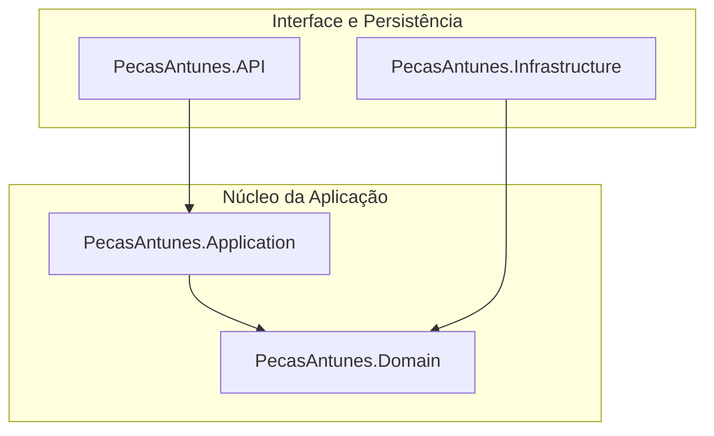

# 🏎️ PecasAntunes  — Sistema  de Gestão de Autopeças.

Projeto em .NET 8 + PostgreSQL (Neon) + Front-end Web, publicado em produção para demonstrar arquitetura limpa, API REST versionada, deploy real e consumo pelo front.

## 🔗 Acesse o projeto em produção.

👉 Front-end (Aplicação Web):
https://victorantunesj.github.io/PecasAntunesApi/

👉 API em Produção (Render):
https://pecasantunes-api.onrender.com

👉 Swagger (Documentação interativa):
https://pecasantunes-api.onrender.com/swagger

👉 HealthCheck:
https://pecasantunes-api.onrender.com/health


## 🧪 Como testar o projeto.

### Testar o sistema completo (Front + API)

#### 1. Abra o front:
👉 https://victorantunesj.github.io/PecasAntunesApi/

#### 2. Clique em “Carregar Peças” para buscar os dados da API em produção

#### 3. Use o formulário para cadastrar uma nova peça

#### 4. Atualize a lista e veja os dados vindo do back-end real (Render + Neon)

### ✅ Testar apenas a API (sem o front)

#### 1. Acesse o Swagger:
👉 https://pecasantunes-api.onrender.com/swagger

#### 2. Use os endpoints:

 - POST /api/v1/AutoPecas – cadastrar peça

 - GET /api/v1/AutoPecas – listar peças

#### 3. Veja o status da API:
👉 https://pecasantunes-api.onrender.com/health

## 🏗️ Estrutura e Arquitetura
O sistema utiliza `Clean Architecture` para garantir desacoplamento entre regra de negócio e infraestrutura.



## 🚦 Endpoints Principais (API)
| Método | Endpoint | Descrição |
| :--- | :--- | :--- |
| `POST` | `/api/v1/AutoPecas` | Cadastra uma nova peça com validação de domínio. |
| `GET` | `/api/v1/AutoPecas` | Lista todas as peças cadastradas. |
| `GET` | `/api/v1/AutoPecas/{id}` | Busca por ID. |
| `PUT` | `/api/v1/AutoPecas/{id}` | Atualiza uma peça. |
| `DELETE` | `/api/v1/AutoPecas/{id}` | Remove uma peça. |
| `GET` | `/health` | HealthCheck da API. |


🧠 Stack Tecnológica
  - .NET 8
 - ASP.NET Core Web API
 - Entity Framework Core
 - PostgreSQL (Neon – banco em produção)
 - Deploy no Render
 - Clean Architecture
 - Versionamento de API (v1)
 - Health Check
 - Swagger (OpenAPI)
 - Front-end em HTML + CSS + JS consumindo API real
 - GitHub Pages para deploy do front


## 📦 Rodar o Projeto Localmente.

⚠️ Produção usa PostgreSQL (Neon).<br>
Local vocé pode usar PostgreSQL local ou SQL Server via Docker (modo alternativo de estudo).

▶️ Modo Produção (usando PostgreSQL / Neon)

#### 1. Configure no `appsettings.Development.json:`

```json
"ConnectionStrings": {
  "DefaultConnection": "Host=SEU_HOST;Database=SEU_DB;Username=SEU_USER;Password=SUA_SENHA;SSL Mode=Require;Trust Server Certificate=true"
}
```

#### 2. Aplicar migrations:

```powershell
dotnet ef database update --project src/PecasAntunes.Infrastructure --startup-project src/PecasAntunes.API
```

#### 3. Rodar API:

```powershell
dotnet run --project src/PecasAntunes.API
```

Acesse:            
http://localhost:5139/swagger

## 🐳 (Opcional) Infraestrutura de Dados com SQL Server (Modo Estudo )

⚠️ Este modo foi usado durante o desenvolvimento local.
Em produção, o projeto usa PostgreSQL (Neon).

```bash
docker pull mcr.microsoft.com/mssql/server:2022-latest
```

```bash
docker run -d ^
  --name sqlserver-pecasantunes ^
  -e "ACCEPT_EULA=Y" ^
  -e "MSSQL_SA_PASSWORD=SenhaForte@123" ^
  -p 1433:1433 ^
  mcr.microsoft.com/mssql/server:2022-latest
```

Connection String local:

```json 
"ConnectionStrings": {
  "DefaultConnection": "Server=localhost,1433;Database=PecasAntunesDb;User Id=sa;Password=SenhaForte@123;TrustServerCertificate=True;Encrypt=False;"
}
```

## 🌐 Deploy em Produção

 - API hospedada no Render (Free)

 - Banco PostgreSQL hospedado no Neon

 - Build via Dockerfile

 - Variáveis de ambiente configuradas no Render

## 👨‍💻 Autor
Victor Antunes<br>Projeto de Portfólio para back-end .NET


